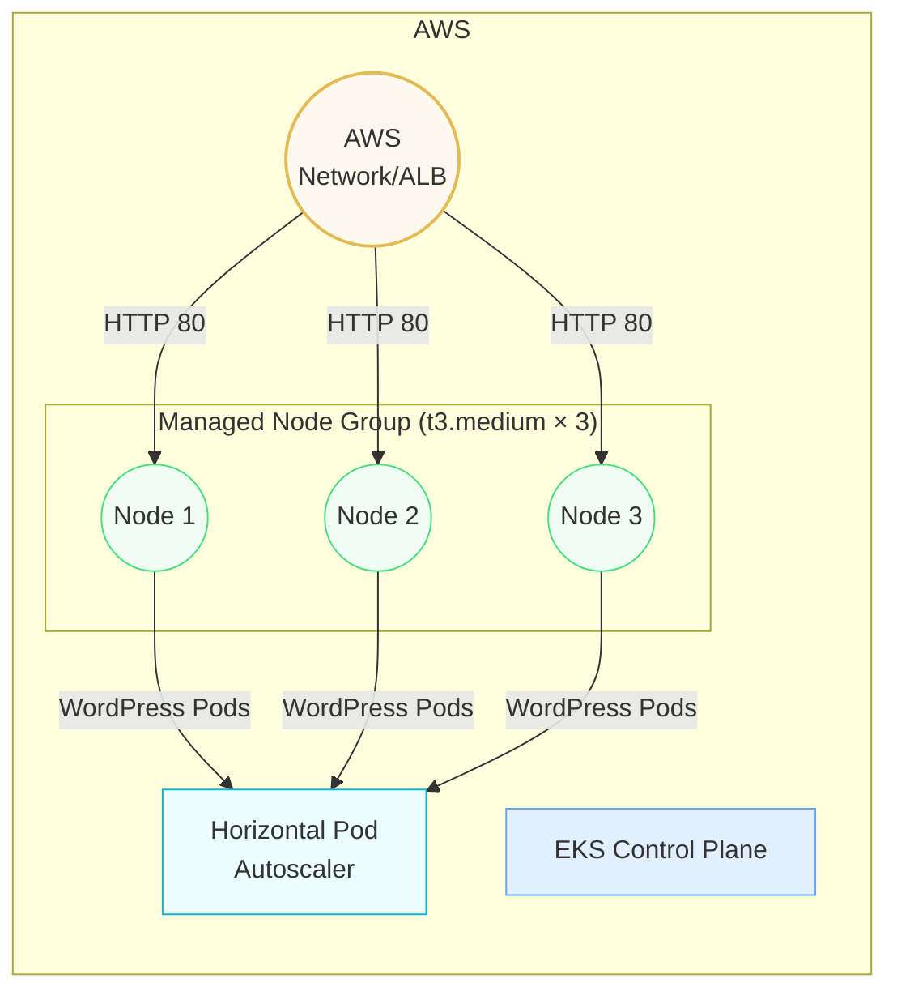
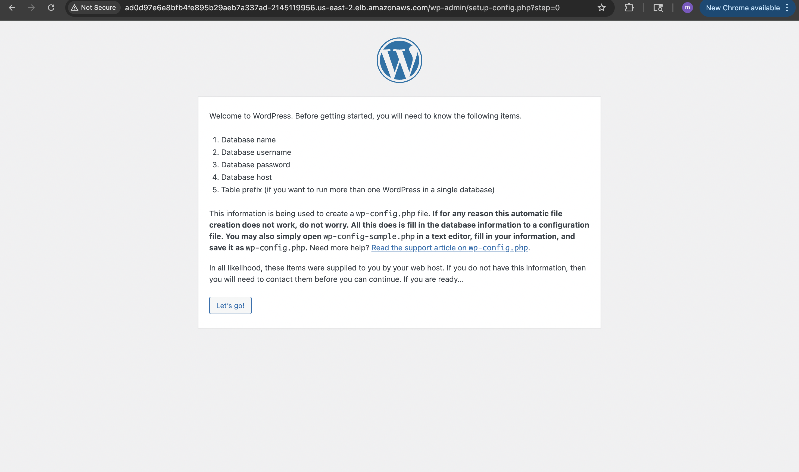
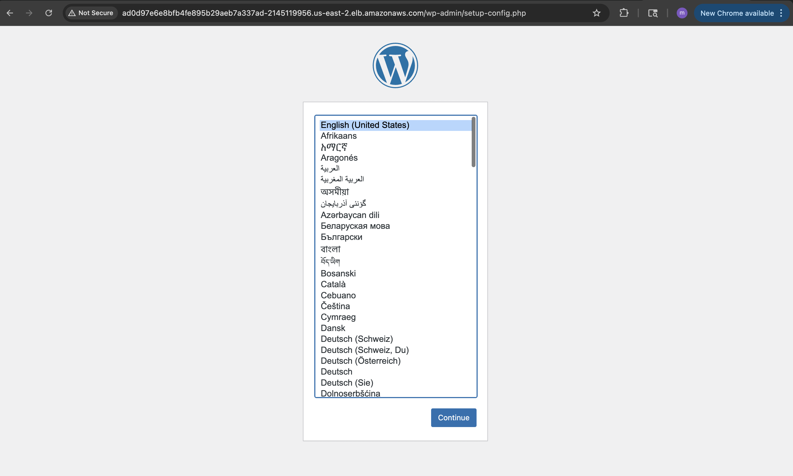

> **Focus:** Container orchestration, IaC, CI/CD & cost-aware scaling on AWS

## 🗺️ Architecture Overview


# WordPress on Amazon EKS

Deploy a production-style WordPress stack on Amazon EKS with Helm, an HPA (Horizontal Pod Autoscaler), and a managed node group.

**Author**  Manaswi Hejeebu — Cloud / DevOps Engineer (mid-career)

---

## 1. What This Project Shows

| Topic                           | Proof in this repo                                  |
|---------------------------------|-----------------------------------------------------|
| Kubernetes basics               | Clear separation of nodes → pods → containers       |
| Infrastructure as Code (IaC)    | `eksctl` command builds the entire cluster          |
| Helm packaging                  | Reusable chart in `my-microservice/`                |
| Auto-scaling                    | `hpa.yaml` scales WordPress 1-5 replicas at 50 % CPU|
| Cost awareness                  | Node group bounds: min 1, max 4 `t3.medium` nodes   |

---

## 2. Repository Contents

.
├── my-microservice/ # Helm chart (Chart.yaml, values.yaml, templates/)
├── hpa.yaml # Horizontal Pod Autoscaler spec
└── README.md


---

## 3. How to Use This Repo

> **Prerequisites**  
> macOS / Linux, Docker, `kubectl`, Helm v3, `eksctl` v0.210+, AWS CLI with admin credentials.

### 3-1  Clone the repo

```bash
git clone https://github.com/ManaswiAnantharaju/WordPress-on-EKS.git
cd WordPress-on-EKS
```
### 3-2 Create the EKS cluster (≈ 15 min)

    eksctl create cluster \
     --name enterprise-cluster \
     --version 1.27 \
     --region us-east-2 \
     --nodegroup-name standard-workers \
     --node-type t3.medium \
     --nodes 3 \
     --nodes-min 1 \
     --nodes-max 4 \
     --managed
  
### 3-3 Install WordPress with Helm

    helm dependency update my-microservice   
    helm install my-microservice ./my-microservice

### 3-4 Add the Horizontal Pod Autoscaler
    kubectl apply -f hpa.yaml

### 3-5 Get the public URL

    kubectl get svc my-microservice \
    -o jsonpath='{.status.loadBalancer.ingress[0].hostname}'

  
### 3-6 ( Optional ) Load-test and watch it scale

   # Watch pods in a separate terminal
    kubectl get pods --watch
    
# Run a quick Siege load test for 2 minutes

    kubectl run siege --rm -i --tty \
    --image yokogawa/siege --restart=Never -- \
    siege -c 20 -t 2m http://<load-balancer-hostname>

You should see replicas increase (up to 5) and then scale back down.


### Demo Screenshots

  |  |  |
